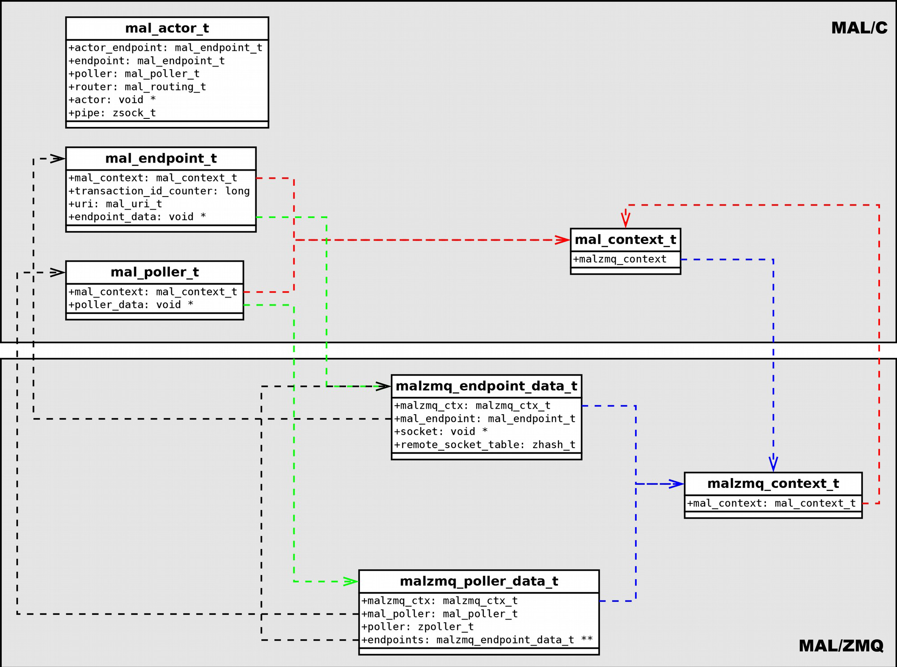

Annexes
=======

Exemple d'Area « TestArea »
---------------------------

Cet exemple permet de tester les aspects suivants du livre MAL :

  -	pattern d'interaction SEND
  -	structure Composite
  -	liste d'éléments
  -	corps de message avec de multiples éléments
  -	champ optionnel ('canBeNull=true')
  -	polymorphisme du dernier élément de corps de message

```xml
<?xml version="1.0" encoding="UTF-8"?>
<mal:specification xmlns:xsi="http://www.w3.org/2001/XMLSchema-instance"
                   xmlns:mal="http://www.ccsds.org/schema/ServiceSchema">
  <mal:area name="TestArea" number="200" version="1">
    <mal:service name="TestService" number="1">
      <mal:capabilitySet number="100">
        <mal:sendIP name="testSend" number="100" supportInReplay="false"
         comment="">
          <mal:messages>
            <mal:send>
              <mal:type area="TestArea" service="TestService"
               name="TestComposite" />
              <mal:type list="true" area="MAL" name="String" />
              <mal:type area="TestArea" service="TestService"
               name="TestAbstractComposite" />
            </mal:send>
          </mal:messages>
        </mal:sendIP>
      </mal:capabilitySet>
      <mal:dataTypes>
        <mal:composite name="TestComposite" shortFormPart="1" comment="">
          <mal:extends>
            <mal:type area="MAL" name="Composite" />
          </mal:extends>
          <mal:field name="stringField" canBeNull="true" comment="">
            <mal:type area="MAL" name="String" />
          </mal:field>
          <mal:field name="intField" canBeNull="true" comment="">
            <mal:type area="MAL" name="Integer" />
          </mal:field>
        </mal:composite>
        <smc:composite name="TestAbstractComposite" comment="">
          <smc:extends>
            <smc:type area="MAL" name="Composite" />
          </smc:extends>
          <mal:field name="intField" canBeNull="false" comment="">
            <mal:type area="MAL" name="Integer" />
          </mal:field>
        </mal:composite>
        <smc:composite name="TestFinalCompositeA" shortFormPart="2"
         comment="">
          <smc:extends>
            <smc:type area="TestArea" service="TestService"
                      name="TestAbstractComposite" />
          </smc:extends>
          <mal:field name="intField2" canBeNull="false" comment="">
            <mal:type area="MAL" name="Integer" />
          </mal:field>
        </mal:composite>
        <smc:composite name="TestFinalCompositeB" shortFormPart="3"
         comment="">
          <smc:extends>
            <smc:type area="TestArea" service="TestService"
                      name="TestAbstractComposite" />
          </smc:extends>
          <mal:field name="stringField" canBeNull="false" comment="">
            <mal:type area="MAL" name="String" />
          </mal:field>
        </mal:composite>
      </mal:dataTypes>
    </mal:service>
  </mal:area>
</mal:specification>
```

Risques de collision
--------------------

Cette annexe liste des risques de collision de noms qui pourraient survenir lors de la génération de code. Des solutions sont proposées. Elles ne sont pour l'instant pas appliquée à la génération de code.

### Champ dans un composite

Ajout du suffixe `_f` au nom du champ de valeur pour éviter une collision possible avec le champ de présence, par exemple pour deux champs MAL nommés `toto` et `toto_is_present`.

```c
bool <field>_is_present;
unsigned int <field>_attribute_tag;
<field type> <field>_f;
```

Format d'encodage du header MALZMQ
----------------------------------
Pour simplifier le format d'encodage du header MAL, les champs `URI From` et `URI To` sont encodés systématiquement et entièrement. 

Version Number | SDU Type | Service Area | Service | Operation | Area Version | Is Error Message | QoSlevel | Session | Transaction Id
---------------|----------|--------------|---------|-----------|--------------|------------------|----------|---------|---------------
Binary value (3 bits) | Unsigned 5-bit Integer (5 bits) | Unsigned 16-bit Integer (16 bits) | Unsigned 16-bit Integer (16 bits) | Unsigned 16-bit Integer (16 bits) | Unsigned 8-bit Integer (8 bits) | Binary value (1 bit) | Unsigned 3-bit Integer (3 bits) | Unsigned 4-bit Integer (4 bits) | Unsigned 64-bit Integer (64 bits)

Spare                 | Priority Flag        | Time-stamp Flag      | Network Zone Flag    | Session Name Flag    | Domain Flag          | Authentication Id Flag
----------------------|----------------------|----------------------|----------------------|----------------------|----------------------|-----------------------
Binary value (2 bits) | Binary value (1 bit) | Binary value (1 bit) | Binary value (1 bit) | Binary value (1 bit) | Binary value (1 bit) | Binary value (1 bit)

Priority                        | URI From                            | URI To
--------------------------------|-------------------------------------|------------------------------------
UInteger (var. mult. of octet)  | Optional MDK (var., mult. of octet) | Optional MDK (var., mult. of octet)
If ‘Priority Flag’ is ‘1’       |

Timestamp                   | Network Zone                        | Session Name                        | Domain                                    | Authentication Id
----------------------------|-------------------------------------|-------------------------------------|-------------------------------------------|------------------------------
Time (var., mult. of octet) | Optional MDK (var., mult. of octet) | Optional MDK (var., mult. of octet) | List<Optional MDK> (var., mult. of octet) | Blob (var., mult. of octet)
If ‘Timestamp Flag’ is ‘1’  | If ‘Network Flag’ is ‘1’            | If ‘Session Flag’ is ‘1’            | If ‘Domain Flag’ is ‘1’                   | If ‘Authentication Id Flag’ is ‘1’

Schéma de description des « classes »
-------------------------------------

Le schéma ci-dessous décrit les différentes classes de l'implantation et leurs relations, les classes sont séparées en deux espaces MAL et transport MAL/CZMQ. La plupart des ces relations sont unitaires, seule la classe malzmq_poller_data_t contient une liste de référence vers la classe `malzmq_endpoint_data_t`.



*Figure 1 - Description des "classes" du MAL*

